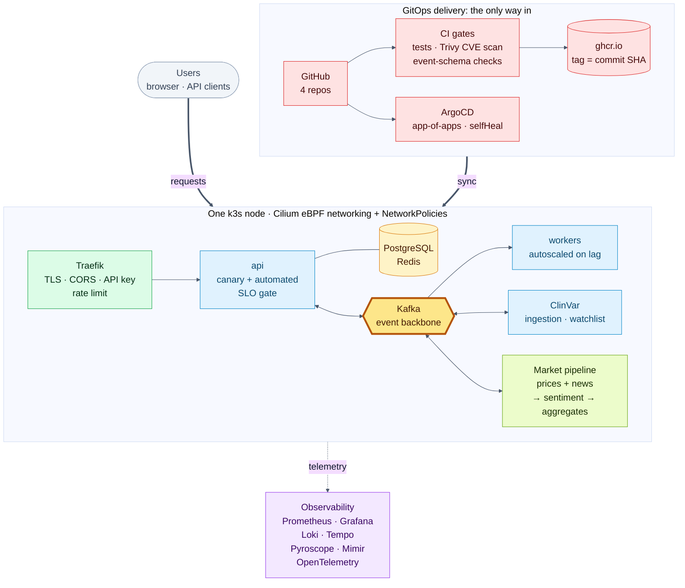
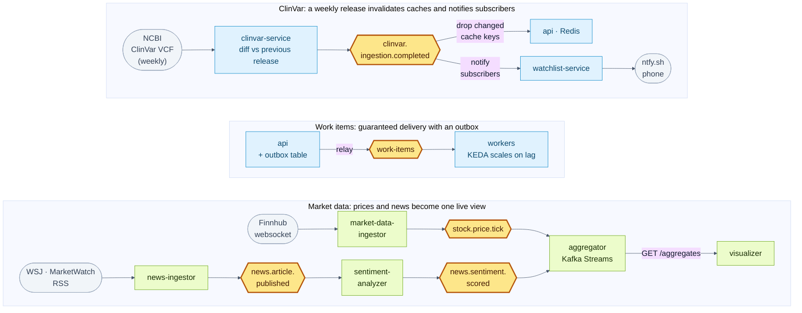

# Architecture diagrams (for the talk)

Two diagrams, each meant to fit one slide. Both are checked against the code and the live cluster, not drawn from memory;
the longer ASCII version and the reasoning live in [`../overview.md`](../overview.md).

| File | Slide idea |
|---|---|
| `system-overview.{mmd,svg,png}` | The whole system in five seconds: how code gets in (GitOps), what runs, and what watches it. |
| `event-flows.{mmd,svg,png}` | The interesting part: three stories told by the Kafka topics. |

Regenerate the images after editing a `.mmd` (Chrome is used so no Chromium download is needed):

```bash
echo '{"executablePath":"/Applications/Google Chrome.app/Contents/MacOS/Google Chrome"}' > /tmp/pptr.json
for n in system-overview event-flows; do
  npx -y @mermaid-js/mermaid-cli@11 -p /tmp/pptr.json -i $n.mmd -o $n.svg -b white
  npx -y @mermaid-js/mermaid-cli@11 -p /tmp/pptr.json -i $n.mmd -o $n.png -b white -w 2200 -s 2
done
```

## System overview



## Event flows



## What is deliberately not on the slides

- **Network policies** are drawn as "NetworkPolicies", not "default-deny everywhere": backlog #126 is still rolling them
  out, and the M13 and `watchlist` namespaces are not covered yet.
- **Beyla** (eBPF auto-instrumentation) and the Mimir remote-write path are experiments with open questions (#145, #135),
  so Mimir appears only in the observability list and Beyla is left out.
- **Versions, hostnames and the node's size** are omitted on purpose: they change and are not the point of a slide.
